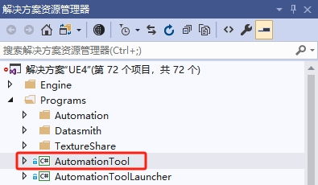

包含 Carla 补丁的虚幻引擎
=============

## 构建步骤
1. 在终端中，导航到要保存虚幻引擎的位置并克隆虚幻引擎仓库：
```shell
git clone https://github.com/OpenHUTB/engine.git
```
注意：尽可能使虚幻引擎文件夹靠近根目录，因为如果路径超过一定长度，则会在步骤 2 中的 `Setup.bat` 返回错误。

2. 运行配置脚本：
```shell
Setup.bat
GenerateProjectFiles.bat
```
    
3. 编译修改后的引擎：
使用 Visual Studio 2019 打开源文件夹内的文件 `UE4.sln`。
在构建栏中，确保已选择`Development Editor`、`Win64`和`UnrealBuildTool`选项。如果需要任何帮助，请查看本指南。
在解决方案资源管理器中，右键单击 `UE4` 并选择`生成`（`Build`）。


4.编译解决方案后，可以打开引擎，通过启动可执行文件 `Engine\Binaries\Win64\UE4Editor.exe` 来检查所有内容是否已正确安装。

笔记：如果安装成功，虚幻引擎的版本选择器应该能够识别。可以通过右键单击任何 `.uproject` 文件并选择 `Switch Unreal Engine version` 来检查这一点。应该会看到一个弹出窗口，显示`Source Build at PATH`，这里 PATH 是选择的安装路径。如果您在右键单击文件 `.uproject` 时看不到此选择器 `Generate Visual Studio project files`，则虚幻引擎安装出现问题，可能需要重新正确安装（双击运行`engine/Engine/Binaries/Win64/UnrealVersionSelector-Win64-Shipping.exe`能达到同样的效果）。

重要：到目前为止发生了很多事情。强烈建议在继续之前重新启动计算机。

5. （可选）运行编辑器

将启动项目设置为 UE4。


右键单击 UE4 项目，将鼠标悬停于"Debug" 上，然后 单击"启动新实例（Start New Instance）" 以启动编辑器（或者，你可以按键盘上的 F5键 来启动编辑器的新实例）。


## 发布安装版本
参考[链接](https://github.com/chiefGui/ue-from-source?tab=readme-ov-file#step-by-step-1) 进行虚幻引擎的发布。

1. 使用 Visual Studio 打开 `UE4.shn` 。
2. 在右侧边栏，您应该会看到一个`解决方案资源管理器`面板。展开`Programs`文件夹并找到`AutomationTool`项目（`Engine\Source\Programs\AutomationTool`）：

3. 右键单击它并选择`生成(Build)`，应该很快。

### 运行安装软件的构建脚本
1. 安装 [Windows 10 SDK](https://developer.microsoft.com/en-us/windows/downloads/windows-10-sdk) ;

2. 运行根目录下的安装构建脚本`GenerateInstalledBuild.bat`。

如果一切顺利，您应该会看到`LocalBuilds`与该文件夹处于同一级别的`Engine`文件夹，并且控制台中没有错误。(还包括一个 InstalledDDC 文件夹：DerivedDataCache)。


### 问题
```text
ERROR: Visual Studio 2017 must be installed in order to build this target.
```
解决：下载`3d5_VisualStudio20171509.rar`进行安装。


```text
Unable to find installation of PDBCOPY.EXE
```
解决：参考 [链接](https://arenas0.com/2018/12/03/UE4_Learn_Build_Binary/) 从 [百度网盘](https://pan.baidu.com/s/1Y0PQeHCMQh7Ln12d_p_Rzw) 下载`X64 Debuggers And Tools-x64_en-us.msi`安装。

```text
无法启动此程序，因为计算机中丢失XINPUT1_3.dll。尝试重新安装该程
```
解决：参考 [链接](http://www.codefaq.cn/category/Windows/) 安装 DirectX Redist (June 2010)。


## 内容
虚幻引擎源码的构成。

### 编译
[编译配置参考](https://docs.unrealengine.com/4.26/zh-CN/ProductionPipelines/DevelopmentSetup/BuildConfigurations/)

### 像素流插件
相关源码位于：`unreal\Engine\Plugins\Media\PixelStreaming\PixelStreaming.uplugin`

### 编辑器界面汉化
资源存储位置：`engine\Engine\Content\Localization\Editor\zh-Hans`，只需使用文本编辑器（例如 Notepad++）编辑`Editor.archive`。


## 问题
* 右键`.uproject`文件没有`Switch Unreal Engine version...`
解决：双击`Engine\Binaries\Win64\UnrealVersionSelector-Win64-Shipping.exe`，出现`Register this directory as an Unreal Engine installation?`后点击`是(Y)`。

* 增加`matlab`插件进行虚幻引擎编译，导致启动虚幻编辑器启动失败，原因不明。


## 参考链接
[UE4初学者系列教程合集-全中文新手入门教程](https://www.bilibili.com/video/BV164411Y732/?share_source=copy_web&vd_source=d956d8d73965ffb619958f94872d7c57  )

[ue4官方文档](https://docs.unrealengine.com/4.26/zh-CN/)

[官方讨论社区](https://forums.unrealengine.com/categories?tag=unreal-engine)

[知乎的虚幻引擎社区](https://zhuanlan.zhihu.com/egc-community)
